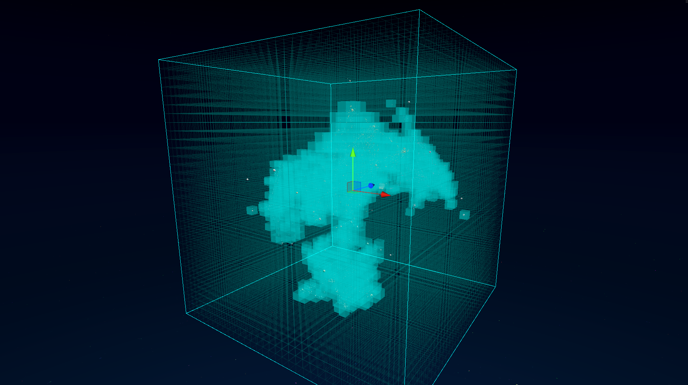
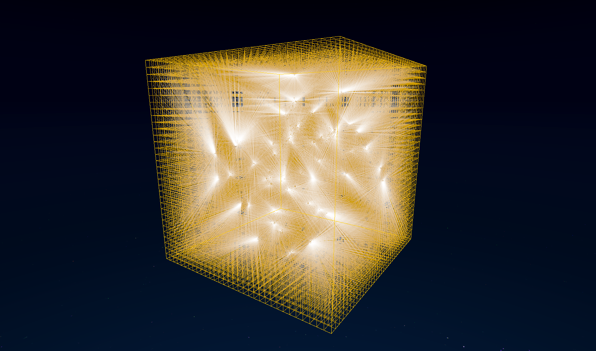
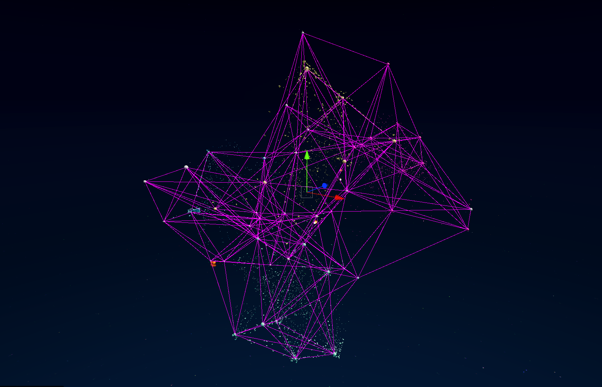
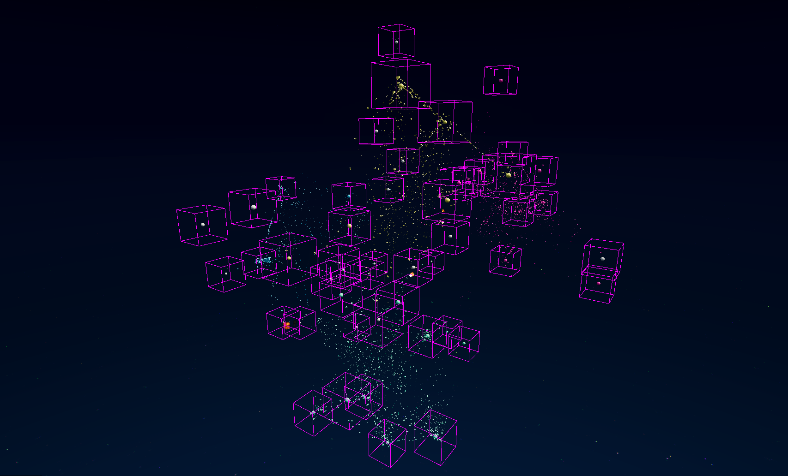
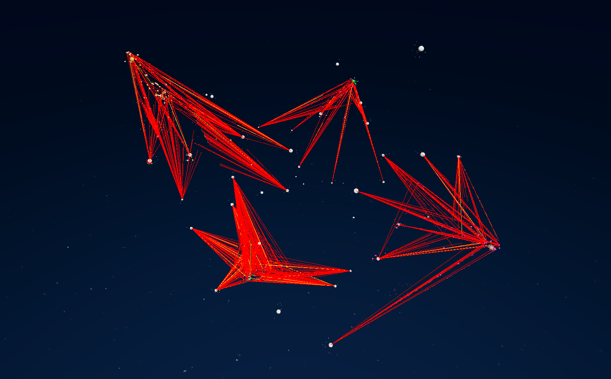
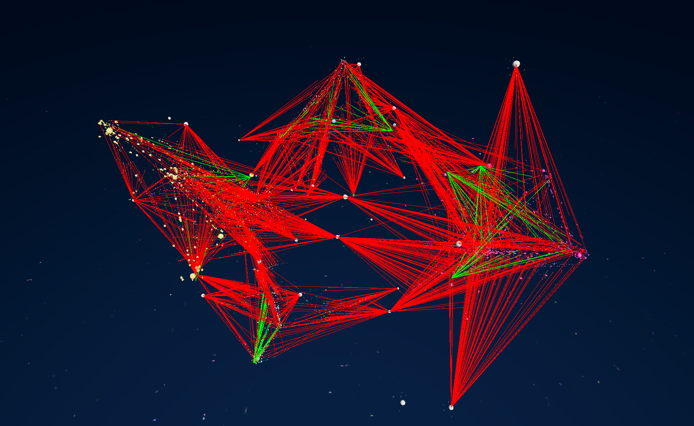
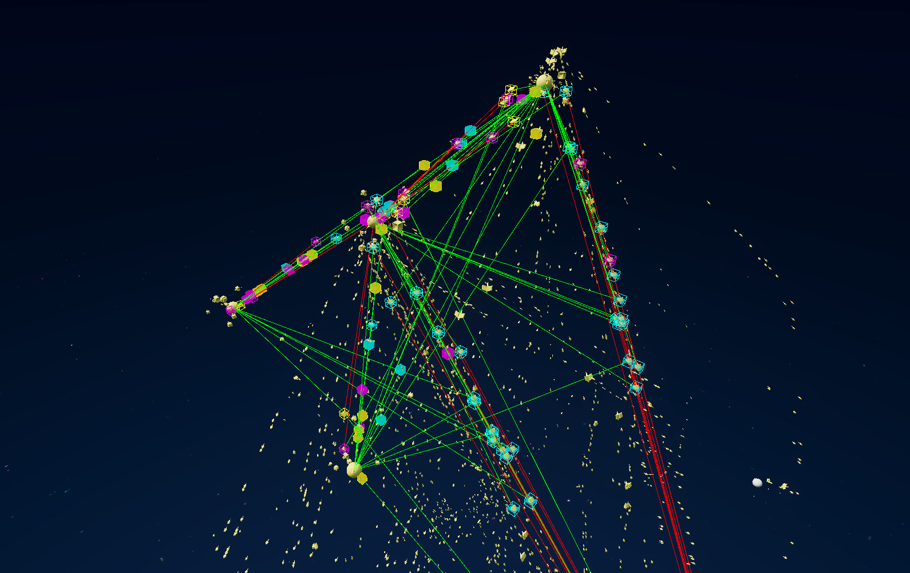

# Debug Views

In the `Main` scene, under the `GameSceneObjects` GameObject, there is a `SimulationDebug` GameObject that can help you understand the inner workings of the game by offering several debug views. You can activate these debug views during Play mode by toggling the various "Modes" checkboxes in the `SimulationDebug` component.

## Spatial Database

This mode draws the spatial database grid, and highlights cells that contain entries.

## Planet Navigation Grid

This mode draws the planet navigation grid, and draws a line from cell center to nearest planet.

## Planets Network

This mode draws the network of neighbor planets.

## Planet Ships Assessment

This mode draws the bounds used by planets to determine which ships are around them.

## Fighter Actions

This mode draws the actions selected by fighters. Green lines represent an action to defend a planet, red lines are actions to attack a planet, and yellow lines are actions to attack a ship or building.

## Worker Actions

This mode draws the actions selected by workers. Green lines represent build actions, and red lines represent planet capture actions.

## Trader Actions

This mode draws actions of traders. Red lines represent an intention to take a resource from a planet, and green lines point to the receiving planets. A colored box on trader ships represent their current cargo. Each resource type has a color, and the cargo can be filled (solid color) or empty (wire box).