# Game Overview

This game is an automated simulation of several teams of spaceships trying to capture planets and eliminate all other teams.

## Planets

The game world consists of planets spawned at random in a sphere area. Planets generate resources, and have a random amount of moons around them.

A planet's resources are used by buildings to perform their function. Planets can generate up to 3 different types of resources.

A planet's moons are used as slots where buildings can be built. Buildings use the resources of the planet that the moon belongs to.

## Teams

Each team in the game starts off with a planet that belongs to them, as well as a Factory building that can produce ships.

Teams will handle building various different ship types in order to capture nearby planets, defend captured planets, and ensure a good distribution of resources among the planets they own.

## Ships

### Fighters

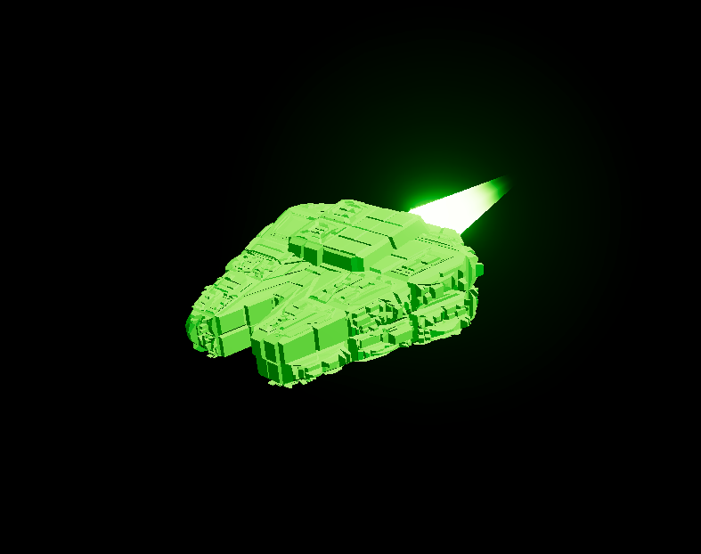 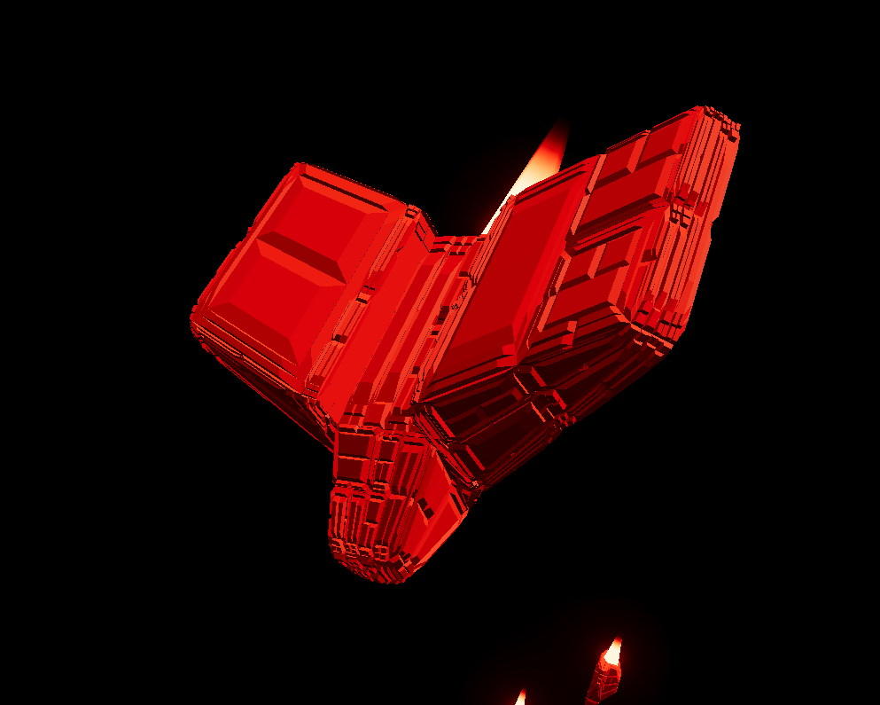 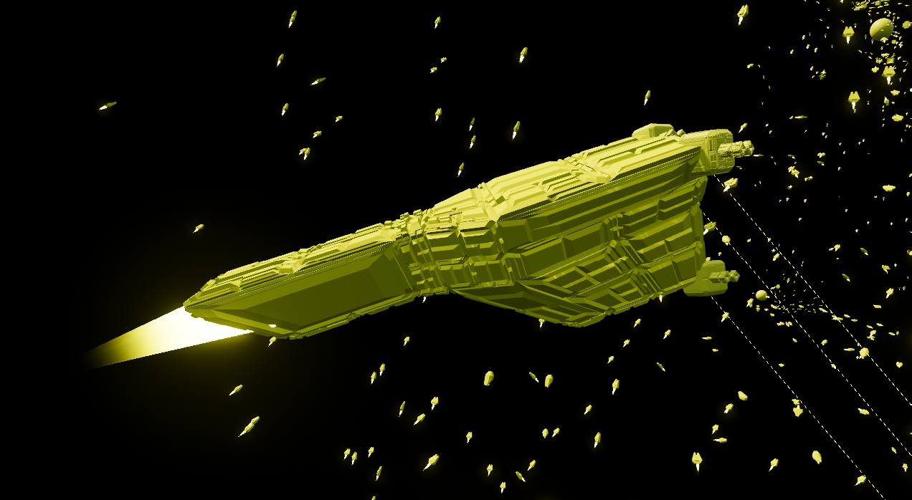

Fighter ships try to defend captured planets from enemies, and attack enemy planets to clear the way for workers to capture them.

### Workers

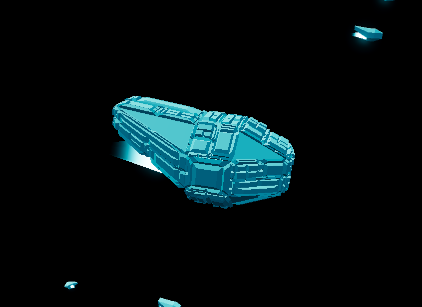 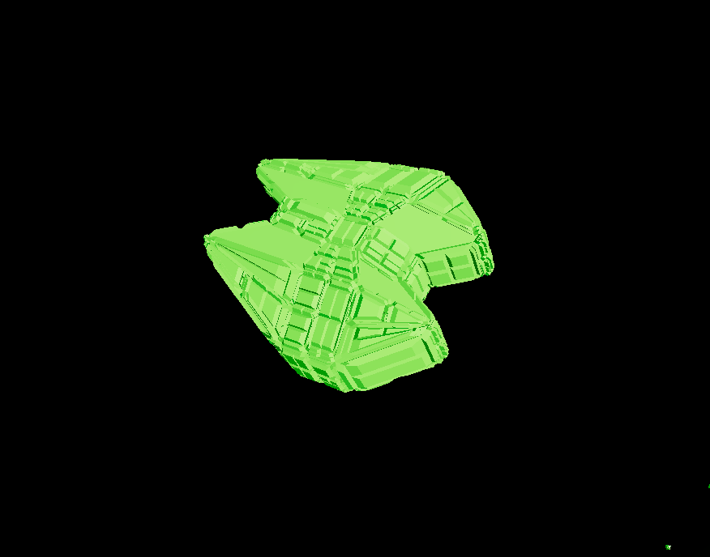

Worker ships can capture planets, as well as build buildings on a planet's moons. Multiple workers can capture the same planet or build the same building at the same time, making the process faster.

### Traders

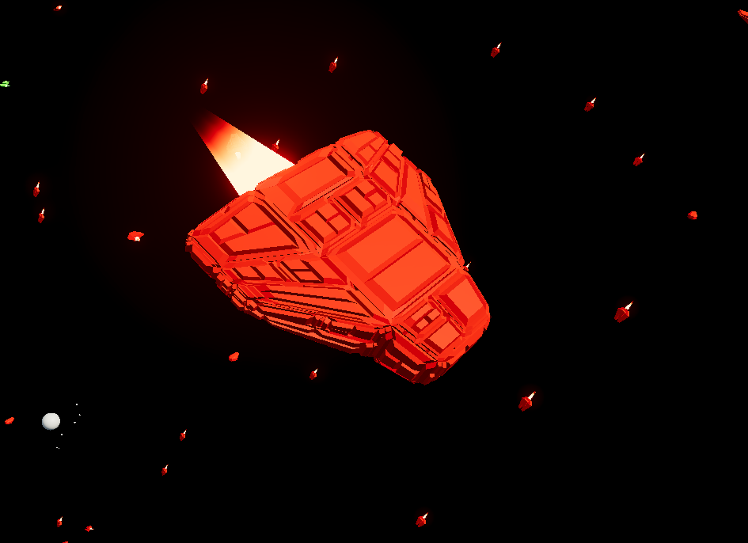 

Traders try to uniformly distribute resources across all the planets captured by a team. They find a planet in need of a certain resource, then find another planet that can give that resource, and then they will go take that resource from the giving planet to the receiving planet. 

Since not all planets generate all 3 types of resources, and some buildings mights need all 3 types of resources to perform certain actions, traders are key to ensuring that all planets can have all of their buildings function at full capacity.

## Buildings

### Factories

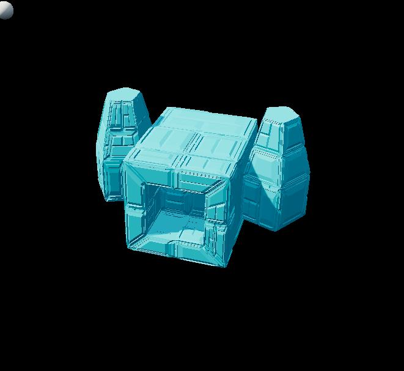

Factories produce ships based on what ship types the team's AI thinks are most important to produce at any moment. Each ship requires a certain amount of resources to produce.

### Turrets

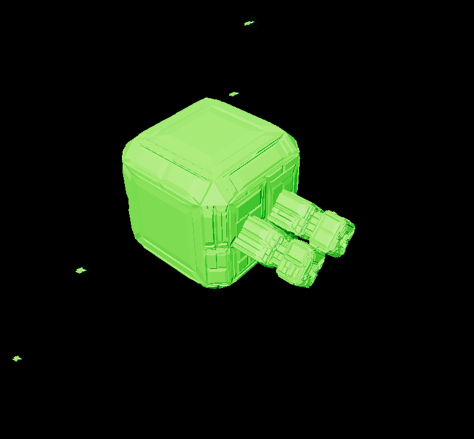 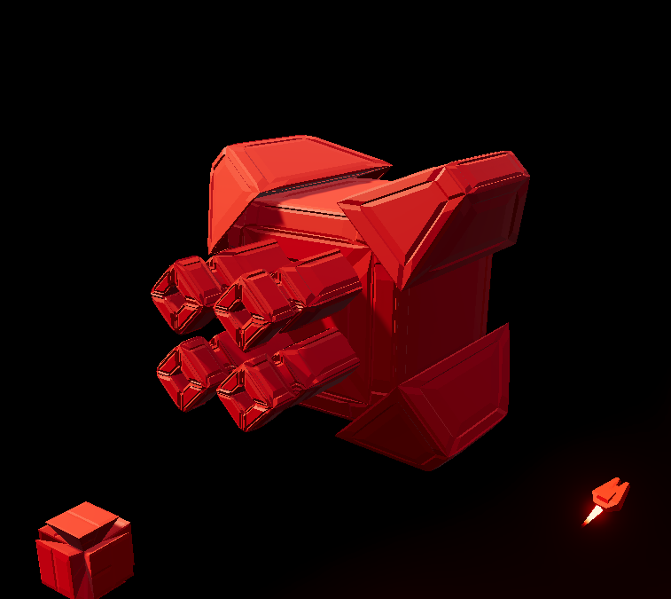

Turrets defent a planet and its buildings by shooting at enemies in range. Turret shots can consume planet resources.

### Research

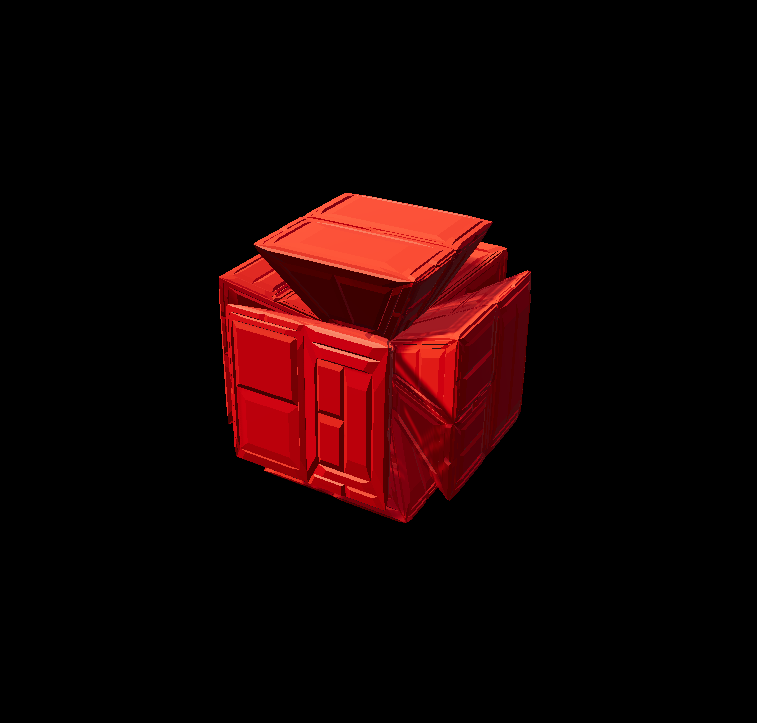 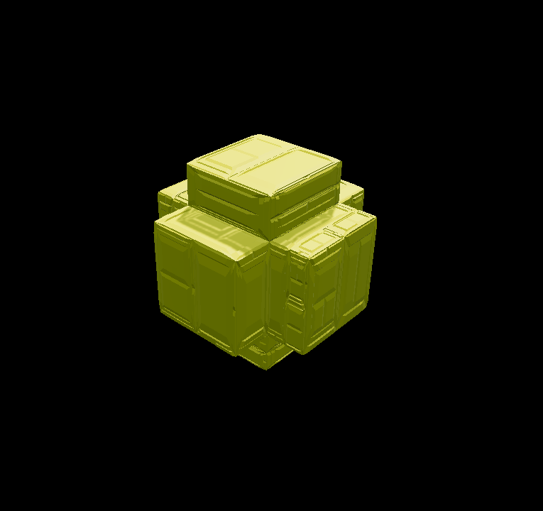 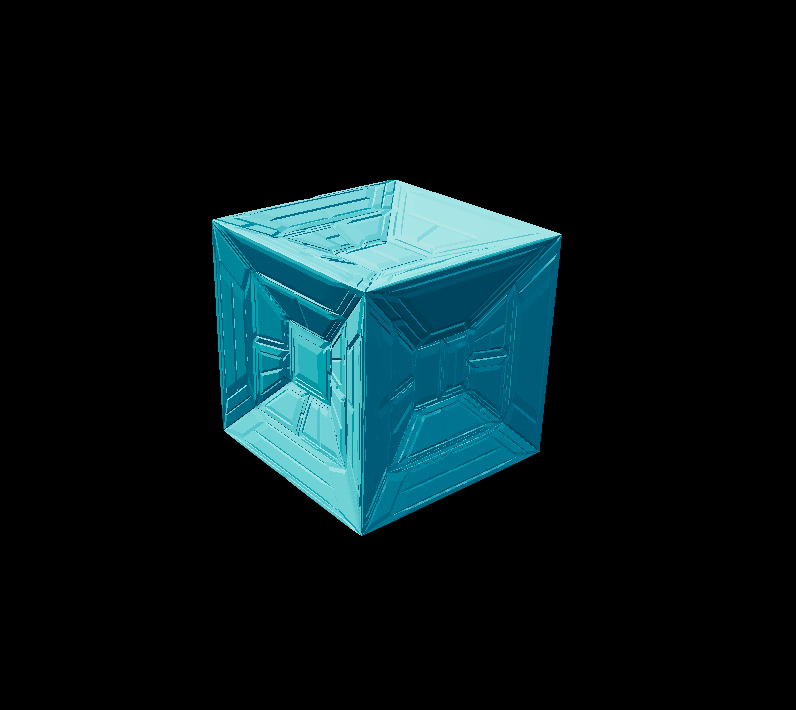

Research buildings provide bonuses that can affect factory build speeds, planet resource generation rates, and ship attributes.
